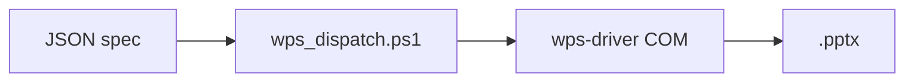

# CO-WPSppt · cursor-openclaw-wps-ppt

[](https://github.com/thenw-123/CO-WPSppt/actions/workflows/extension-build.yml)
[](LICENSE)

**CO-WPSppt**：用一份 **JSON 规格** 驱动 **PowerShell + WPS COM**，一次生成 `.pptx`。可选 **OpenClaw MCP** 或 **VS Code / Cursor 扩展** 调用，底层都是同一套 `tools/` + `wps-driver/`。

## 核心逻辑（一张图）



| 你怎么触发 | 实际发生的事 |
|------------|----------------|
| 本机 PowerShell | `.\tools\wps_dispatch.ps1 -Action <action> -ArgsJson '<json>'` |
| **CO-WPSppt** 扩展 | 扩展调打包后的 `bundled/.../wps_dispatch.ps1`（仍要 Windows + WPS） |
| **OpenClaw**（Cursor MCP） | `openclaw_invoke`：`tool` = `wps-ppt`，`action` + `args_json` 与上列一致 |

`manifest.json` 把各 `action` 登记给网关；**`specs/`** = 小示例 + Schema，**`examples/`** = 完整大稿与素材。扩展与 MCP 只是壳，**最终都落到 `wps_dispatch.ps1`**（扩展内为打包副本）。细节见下文与 [docs/MCP-OpenClaw与wps-ppt.md](docs/MCP-OpenClaw与wps-ppt.md)。

## CO-WPSppt — Cursor / VS Code 扩展（`.vsix`）

本仓库包含可打包的扩展 **[extension/](extension/)**（显示名 **CO-WPSppt**，扩展 ID `co-wpsppt.co-wpsppt`）。

### 本地打包安装

1. 安装 Node.js 20+，在 `extension/` 下执行：
   ```bash
   cd extension
   npm install
   npm run vscode:package
   ```
2. 得到 **`co-wpsppt-<version>.vsix`**（在 `extension/` 目录下）。在 Cursor 中：**Extensions: Install from VSIX…** 选择该文件。
3. 命令面板中搜索 **CO-WPSppt** 运行 Doctor、校验、Run spec 等（详见 [extension/README.md](extension/README.md)）。

### 发布到 GitHub Releases（自动带 VSIX）

1. 将 `extension/package.json` 里的 **`repository` / `bugs` / `homepage`** 改为你的 GitHub 仓库 URL。
2. 推送代码后打标签并推送，例如 `v1.6.0`：
   ```bash
   git tag v1.6.0
   git push origin v1.6.0
   ```
3. Actions 中的 **Release VSIX (CO-WPSppt)** 会构建扩展并把 `.vsix` 挂到对应 **Release** 上。详细说明见 **[docs/CO-WPSppt-GitHub发布.md](docs/CO-WPSppt-GitHub发布.md)**。

若上架 **VS Marketplace**，需单独注册 Publisher 并执行 `vsce publish`（与 GitHub 分发独立）。

## 本机一条命令试跑

```powershell
cd <仓库根目录>
.\tools\wps_dispatch.ps1 -Action run-spec -ArgsJson '{"specPath":"specs/example-spec.json"}'
```

### Cursor + OpenClaw MCP

`openclaw_discover` → 确认有 **`wps-ppt`** → **`openclaw_invoke`**（`action` / `args_json` 同上）。排错与注册 `manifest.json` 见 **[docs/MCP-OpenClaw与wps-ppt.md](docs/MCP-OpenClaw与wps-ppt.md)**。

### 升级版 `run-spec` 能做什么

- **演讲者备注**：每页可选 `notes`，也可事后 `set-notes`。
- **自动目录**：`autoAgenda: true` 时在 **第 2 页**插入议程，条目来自后面各页标题。
- **主题/字体**：`theme.titleFont` / `theme.bodyFont`（尽力套全文）；有 `.thmx` 可填 `theme.themePath`。
- **叙事版式（1.5+）**：`layout` 可为 `timeline`、`comparison`、`thesis-chain`、`argument`、`thesis-vertical`（**一页一论题 · 竖向三步**）、`swot`（**四象限**）；在空白幻灯片上排形状以减轻版式重复；见 Schema 与 [specs/narrative-layouts-demo.json](specs/narrative-layouts-demo.json)。
- **结构校验**：`run-spec` 默认先做 spec 校验（与 [specs/ppt-spec.schema.json](specs/ppt-spec.schema.json) 对齐）；`args_json` 里设 `skipValidation: true` 可跳过（不推荐）。
- **validate-spec**：仅校验 JSON、不启动 WPS；失败时 `data.errors` 为字符串数组，`code` 为 `VALIDATION_FAILED`。
- **doctor**：检查工程路径、`output/` 可写、会话文件、各 ProgID 是否注册；`{"comProbe":true}` 时会尝试 `Get-WpsApplication`（可能拉起 WPS）。
- **可读输出**：调试时设环境变量 `OC_PRETTY_JSON=1`，stdout JSON 会换行缩进。

### PNG 图表（L1，优先于 COM 内嵌图）

- 在某一页提供 **`chart_data`**（`labels` + `series[].values`）且 **`chart_type`** 为 `bar` / `line` / `donut` 时，`run-spec` 会调用 **`tools/chart_to_png.py`**（matplotlib，无界面）生成 PNG，并插入该幻灯片。
- **依赖**：Python 3 + `pip install -r requirements-charts.txt`。`doctor` 会回报 `chartPng.pythonAvailable` 与 `matplotlibImportOk`。
- 无 Python 或渲染失败时：**不中断整稿**，仅保留文字要点；详见 [specs/example-chart-png.json](specs/example-chart-png.json)。
- 设置 **`chart_render`: false**（或 `off`/`none`）可强制不生成 PNG。

### 二期：COM 内嵌图 + 安全远程配图

- **`chart_engine`: `"com"`**：用 WPS COM 内嵌 Excel 数据图（`bar`/`line`/`donut`），见 [wps-driver/Wps.ChartCom.ps1](wps-driver/Wps.ChartCom.ps1)。失败时若 **`chart_fallback_png`** 非 `false`，仍会尝试 matplotlib PNG。
- **`chart_engine`** 省略或为 **`png`**：仅用 PNG 路径（与一期一致）。
- **`imageUrl`**：按 [wps-driver/Wps.UrlAsset.ps1](wps-driver/Wps.UrlAsset.ps1) 拉取 **png / jpeg / gif / webp**（**不含 svg**，降低 XXE/脚本风险）。与 **`image`** 本地路径 **二选一**。
- 示例：[specs/example-chart-com.json](specs/example-chart-com.json)、[specs/example-imageurl.json](specs/example-imageurl.json)。

### 安全（`imageUrl` / SSRF）

- **默认仅 HTTPS**；仅在开发环境可设 **`OC_ASSET_FETCH_ALLOW_HTTP=1`** 允许 HTTP（**勿在生产/不可信 spec** 使用）。`doctor` 会显示 `assetFetchInsecureHttpAllowed`。
- **解析 DNS 后拒绝** 私网、回环、链路本地、CGNAT、`169.254/16` 等；拒绝 URL 中带 **用户名密码**；拒绝 **非 http(s)** 协议。
- **重定向**：每一跳重新做同样检查，防止跳向内网。
- **体积**：默认最大约 5MiB（`assetFetch.maxBytes` 可调，硬顶约 25MiB）。
- **类型**：仅允许常见 `image/*`，与扩展名绑定写入磁盘。
- **强烈建议** 在生产为 spec 配置 **`assetFetch.allowedHosts`**（主机名 **精确** 匹配，大小写不敏感），只放行自家 CDN/图床。
- **`assetFetch.softFail`: true** 时拉取失败只记 Verbose、**不**中断整稿（默认 **false**，失败即中止，避免静默缺图）。

### 主题目录（L2）

- 将 **`.thmx`** 放入 [themes/](themes/)，spec 中 `theme.themePath` 写相对路径（见 [themes/README.md](themes/README.md)）。

### 模板库（L3）

- [specs/templates/](specs/templates/) 提供大纲与答辩骨架 JSON，见 [specs/templates/README.md](specs/templates/README.md)。

### 测试（L5）

```powershell
cd <仓库根目录>
Invoke-Pester .\tests\Validation.Tests.ps1
Invoke-Pester .\tests\UrlAsset.Tests.ps1
```

（仓库自带脚本兼容 **Pester 3.x**；若已装 Pester 5，同一命令亦可运行。）

### 失败时 `code` 字段（便于 Agent 分流）

| `code` | 含义 |
|--------|------|
| `VALIDATION_FAILED` | spec/JSON 或校验逻辑报错 |
| `COM_UNAVAILABLE` | 无法创建 WPS COM |
| `NO_SESSION` | 会话/路径相关（启发式匹配消息） |
| `SAVE_DENIED` | 权限或拒绝访问 |
| `UNKNOWN_ACTION` | `dispatch` 不认识 `action` |
| `ASSET_FETCH_DENIED` | `imageUrl` 违反策略或非法响应（SSRF/类型/大小等） |
| `RUNTIME_ERROR` | 其他未分类错误 |

## 仓库结构

| 路径 | 说明 |
|------|------|
| `manifest.json` | OpenClaw：`wps-ppt` 工具与各 `action` 注册 |
| `tools/wps_dispatch.ps1` | **推荐入口**：`-Action` + `-ArgsJson` 统一调度 |
| `tools/*.ps1` | 各 action 直调；stdout **一行 JSON** |
| `wps-driver/*.ps1` | COM 封装、叙事版式、图表、安全拉图、校验 |
| `specs/` | 轻量示例 JSON、[ppt-spec.schema.json](specs/ppt-spec.schema.json)、模板；见 [specs/README.md](specs/README.md) |
| `examples/` | 完整演示稿、配套静态资源与生成脚本；见 [examples/README.md](examples/README.md) |
| `releases/` | 可选：预构建 **`.vsix`** 与安装说明 |
| `extension/` | **CO-WPSppt** Cursor/VS Code 扩展源码 |
| `themes/` | 可选 `.thmx`（L2） |
| `tests/` | Pester（L5） |
| `docs/` | 发布与 MCP 说明；见 [docs/README.md](docs/README.md) |
| `skills/drive-wps-ppt/SKILL.md` | Agent 操作约定 |
| `.cursor/rules/wps-ppt-pipeline.mdc` | Cursor 规则 |
| `requirements-charts.txt` | PNG 图表 Python 依赖 |
| `CONTRIBUTING.md` / `SECURITY.md` / `CHANGELOG.md` | 贡献、安全、变更记录 |

## 环境要求

- Windows，已安装 **WPS Office**（含演示）。
- PowerShell 5.1+（或 PowerShell 7；需与 WPS COM **位数一致**，常见为 64 位）。
- 本机已注册 COM，可自查：

```powershell
Get-CimInstance Win32_ClassicCOMClassSetting |
  Where-Object { $_.ProgId -match 'Kwpp|wpp|KWPS' } |
  Select-Object ProgId
```

## 本地试跑（不经过 Gateway）

在项目根目录执行（将路径换成你的机器上的实际根目录）。**优先在同一 PowerShell 会话里用点调用**，避免再套一层 `powershell.exe` 时引号把 JSON 弄坏：

```powershell
cd <仓库根目录>
.\tools\wps_run_spec.ps1 -ArgsJson '{"specPath":"specs/example-spec.json"}'
```

若必须从 `cmd.exe` 或 CI 再起进程，可把 JSON 放进变量或 **`OC_ARGS_JSON` 环境变量**（[Read-OcArgs](wps-driver/Wps.Common.ps1) 在 `-ArgsJson` 为空时会读取）。

成功时 stdout 为一行 JSON，`data.path` 为生成的 `.pptx`。

单次 `new`：

```powershell
powershell -NoProfile -ExecutionPolicy Bypass -File .\tools\wps_new.ps1 -ArgsJson '{"outPath":"output/manual.pptx"}'
```

网关侧：把本仓库加入工具搜索路径并加载 [manifest.json](manifest.json)；Cursor 里可开 [`.cursor/rules/wps-ppt-pipeline.mdc`](.cursor/rules/wps-ppt-pipeline.mdc)，Agent 按 [`skills/drive-wps-ppt/SKILL.md`](skills/drive-wps-ppt/SKILL.md) 调 `openclaw_invoke`。

## 会话与状态

- `logs/wps-session.json`：当前 `presentationPath`，供 `add-slide`、`set-text` 等脚本找到活动文档。
- `run-spec` 会重写会话为新生成的文件。

## 故障排查

| 现象 | 可能原因 |
|------|----------|
| Invalid class string / 无法创建 COM | 未装 WPS 或 ProgID 不同；驱动里已按多种 ProgID 依次尝试 |
| 找不到会话 | 先执行 `new` 或 `open` |
| 自动化无反应 | WPS 弹窗拦截、安全中心禁止宏/COM；尝试信任本机脚本目录 |
| 保存失败 | 无写权限、`output/` 不存在（脚本会自动建目录） |

## Roadmap（摘要）

图表 PNG / COM、远程 `imageUrl`、主题 `.thmx`；长期：动画、母版占位符、会话 `attach` 等。

## 许可

本项目以 **[MIT License](LICENSE)** 授权，版权所有 © 2026 **then_132423@qq.com**。扩展子目录的 [extension/LICENSE](extension/LICENSE) 与根目录保持一致。
